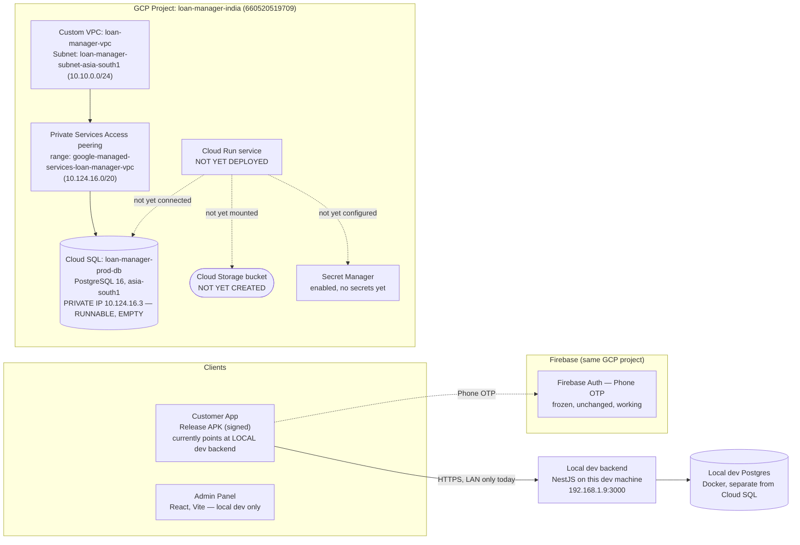

# Production Deployment Checkpoint

**Checkpoint date:** 2026-07-23 (end of session)
**Status:** GCP production deployment in progress, **deliberately paused** after Cloud SQL instance creation, per explicit instruction. Nothing below this checkpoint has been created yet.

This is the authoritative, up-to-date record of exactly what exists in
production infrastructure right now. Read this before assuming anything
about what's deployed — the answer as of today is: **a database server
exists and is empty; nothing else does.**

---

## 1. Current architecture

**What's real and working today:** the local dev stack (backend + Postgres in Docker on this machine, reachable at `192.168.1.9:3000`) and Firebase Phone Auth against the shared `loan-manager-india` project. The signed Release APK built today points at the **local** backend, not GCP.

**What's provisioned in GCP but not yet connected to anything:** the VPC, the peering, and the Cloud SQL instance.

**What doesn't exist yet:** Cloud Storage bucket, Secret Manager secrets, Cloud Run service, any domain/SSL mapping.

---

## 2. Cloud SQL status

| Field | Value |
|---|---|
| Instance name | `loan-manager-prod-db` |
| State | `RUNNABLE` |
| Region / Zone | `asia-south1` / `asia-south1-c` |
| PostgreSQL version | `POSTGRES_16` (installed `16_14`) |
| Machine tier | `db-custom-1-3840` — 1 vCPU / 3.75 GB RAM, **Enterprise edition**, `ZONAL` availability |
| Storage | 10 GB SSD (`PD_SSD`), auto-resize enabled |
| Networking | **Private IP only** — `10.124.16.3`. `ipv4Enabled: false` (no public IP exists at all) |
| Attached network | `loan-manager-vpc` |
| Backups | Enabled, daily at 17:00, 7 backups retained |
| Point-in-time recovery | Enabled, 7-day transaction log retention |
| Deletion protection | Enabled |
| TLS | `sslMode: ENCRYPTED_ONLY` (connections must be encrypted) |
| Connection name | `loan-manager-india:asia-south1:loan-manager-prod-db` |
| Estimated cost | ~$55–65/month (ballpark from published Enterprise-edition rates for this tier/region — confirm via GCP Pricing Calculator or first invoice) |

**Deliberately not yet created on this instance:** any database, any user, any password. The instance itself is fully configured and verified; it's just empty. This was an explicit instruction to defer, not an oversight.

---

## 3. Google Cloud resources created

**Project:** `loan-manager-india`, project number `660520519709`, billing enabled (`billingAccounts/016117-E1B81D-B5AE8F`).

**APIs enabled (12 total):**
| API | Why |
|---|---|
| `run.googleapis.com` | Cloud Run (backend hosting) |
| `cloudbuild.googleapis.com` | Building the backend container |
| `artifactregistry.googleapis.com` | Storing built container images |
| `sqladmin.googleapis.com` | Cloud SQL |
| `secretmanager.googleapis.com` | Secret Manager |
| `storage.googleapis.com` | Cloud Storage |
| `iam.googleapis.com` | Service accounts / permissions |
| `serviceusage.googleapis.com` | Managing the API list itself |
| `logging.googleapis.com` | Cloud Logging |
| `monitoring.googleapis.com` | Cloud Monitoring |
| `compute.googleapis.com` | *Added mid-session* — required for VPC network operations (private IP prerequisite) |
| `servicenetworking.googleapis.com` | *Added mid-session* — required for the Cloud SQL private-services peering |

**Networking:**
| Resource | Detail |
|---|---|
| VPC | `loan-manager-vpc` — custom-mode (deliberately not the project's pre-existing auto-mode `default` network, which still exists untouched but is unused by this deployment) |
| Subnet | `loan-manager-subnet-asia-south1` — `10.10.0.0/24`, Private Google Access enabled |
| Reserved peering range | `google-managed-services-loan-manager-vpc` — `10.124.16.0/20`, purpose `VPC_PEERING` |
| Private Services Access peering | Connected, service `servicenetworking.googleapis.com`, network `loan-manager-vpc` |

**Compute/data:**
| Resource | Detail |
|---|---|
| Cloud SQL instance | `loan-manager-prod-db` — see §2 |
| Cloud Storage bucket | Not created |
| Secret Manager secrets | Not created |
| Cloud Run service | Not deployed |
| Domain mapping | Not configured |

**Local tooling:** `gcloud` CLI (v577.0.0) installed on this dev machine via winget, added to the user's PATH permanently, authenticated as `z31761990@gmail.com`, active project set to `loan-manager-india`.

---

## 4. Firebase project status

- Project `loan-manager-india` reused for production (not a separate project) — deliberate, to keep Phone Auth's already-approved/frozen state intact rather than re-earning SHA registration and Play Integrity trust from zero on a new project.
- **Phone Auth: unchanged, frozen, working.** No modifications made this session. See the `phone_auth_frozen` memory/`TODO_NEXT_SESSION.md` §2 (prior version) for why it's frozen.
- **Not yet done:** a dedicated **production** Firebase Admin service account has not been generated (local dev currently uses its own service account key — a separate production one should be created via Firebase Console → Project Settings → Service Accounts → Generate new private key, then stored in Secret Manager, never in a repo file).
- **Not yet done:** the release keystore's SHA-1/SHA-256 fingerprints (below) are not yet registered in the Firebase Console. Required before Phone Auth will work correctly in a release-signed build.
- Cloud Messaging (FCM): confirmed not implemented in either app (a listed-but-unused dependency in the Customer App, explicit "no push delivery" comment in the backend). No action needed unless/until that becomes a real feature.

---

## 5. Signing keystore status

| Field | Value |
|---|---|
| Keystore file | `C:\Users\Administrator\LoanManagerSigning\customer-app\loan-manager-customer-app-upload.jks` — **outside the repo, outside OneDrive**, on this dev machine only |
| Alias | `upload` |
| Format | PKCS12 (store password and key password are identical — a PKCS12 requirement, not a mistake) |
| Validity | 10,000 days from 2026-07-23 (until ~2053-12-08) |
| SHA-1 | `f8:97:d4:b0:3b:b2:8b:94:91:9c:99:25:8a:ff:9b:ef:cb:cc:a8:0c` |
| SHA-256 | `8e:9a:24:b3:f2:83:44:5e:fa:60:8a:58:34:b7:04:a8:ba:68:d4:5c:b8:8e:09:fd:40:50:d5:07:67:7e:d3:3f` |
| `key.properties` | `apps/customer-app/android/key.properties` — gitignored, confirmed never tracked (`git check-ignore` verified), contains the plaintext passwords + absolute path back to the `.jks` above |
| `build.gradle` wiring | Real `signingConfigs.release` reading from `key.properties`; falls back to debug signing with a build warning if that file is ever absent |
| Backup status | Backup guidance written to `LoanManagerSigning\customer-app\README.txt` (password-manager + offline-copy strategy documented; **not yet actually backed up externally** — that's on the user to do) |
| **Not yet done** | Registering the SHA-1/SHA-256 above in Firebase Console (§4) |

**This is the single most critical artifact in the release pipeline.** If lost after a real Play Store publish, no future update can be signed compatibly. See the README in the keystore folder for the full backup strategy.

---

## 6. Release APK location

A signed Release APK was built **today**, pointed at the **local dev backend**, not production — because GCP deployment is mid-flight and the user wanted something usable immediately.

| Field | Value |
|---|---|
| Path | `apps\customer-app\build\app\outputs\flutter-apk\app-release.apk` |
| Size | 67.9 MB |
| Signed with | Production upload keystore (verified via `apksigner`, SHA-256 matches §5) |
| Backend it talks to | `http://192.168.1.9:3000/api` — this dev machine's local backend. **Only works while that backend is running and the installing device is on the same network.** |
| Firebase | Enabled, real `loan-manager-india` project |
| Includes | Every fix from this session: required-document submission gate, back-button/PopScope regression fix, profile UX fixes (validation-scroll, text-overflow), notification-navigation crash fix, backend notification-recipient routing fix |

This build will need to be re-cut once the production backend (Cloud Run + real domain) exists — see §7, item 9.

---

## 7. Pending production tasks — exact resume order

1. **Cloud Storage** — create the documents bucket; mount as a Cloud Run volume (`UPLOADS_DIR` points at the mount path, zero app code changes — `LocalDiskStorageService` keeps working unchanged). Bridge approach, not a real `FirebaseStorageService` integration (that stays deferred).
2. **Secret Manager** — create secrets for `DATABASE_URL` and a **new, production-dedicated** Firebase Admin service account (§4).
3. **Cloud SQL database + user** — create the application database and a least-privilege user/password on the already-existing instance (§2).
4. **Cloud Run deployment** — deploy the backend container. **Known gap to apply at this step:** `main.ts` reads `BACKEND_PORT` (defaults to 3000); Cloud Run needs `BACKEND_PORT=8080` set explicitly and `--port=8080` at deploy time, or the container won't receive traffic correctly.
5. **Register release keystore fingerprints in Firebase Console** (§4/§5) — manual, user-only action.
6. **Domain mapping + SSL** for the Cloud Run service (Google-managed cert, automatic once DNS is pointed).
7. **Update Customer App `env/production.json`** — real API domain, `FIREBASE_ENABLED=true`, real project ID.
8. **Smoke-test the deployed production backend** before pointing a real release build at it.
9. **Build + verify a new production Release APK** (pointed at the real prod domain) end-to-end on a physical device: login, loan application, document upload, rejection, re-upload, notifications, approval workflow.
10. **Freeze the Customer App.**
11. Only then: begin the Admin Panel implementation roadmap (already audited and planned this session — explicitly not started).

**Immediate next step for the next session: item 1 (Cloud Storage bucket).** Nothing blocks it — VPC, APIs, and region are already in place.

**Also still outstanding, unrelated to GCP infra:** dev-DB test data cleanup (approved scope, not yet executed — this session's QA added more test applications on top of existing clutter). See `TODO_NEXT_SESSION.md` §7.
