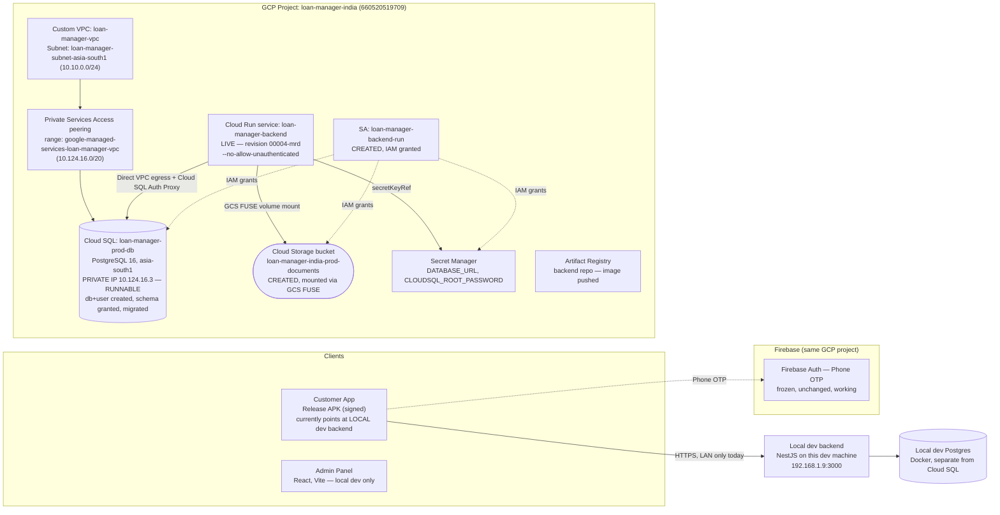

# Production Deployment Checkpoint

**Checkpoint date:** 2026-07-24 (mid-session, while user tests the Release APK on a physical device)
**Status:** Backend is **live on Cloud Run**, migrated, and verified end-to-end (revision `loan-manager-backend-00004-mrd`, serving 100% traffic, `--no-allow-unauthenticated`). Not yet publicly usable — no domain, no Firebase Admin auth, `CORS_ORIGIN` still a placeholder. See §7 for what's left.

This is the authoritative, up-to-date record of exactly what exists in
production infrastructure right now. Read this before assuming anything
about what's deployed.

---

## 1. Current architecture

**What's real and working today:** the Cloud Run backend is live and verified (migrated schema, GCS-backed storage, DB connectivity — see §7 for the exact verification done). It is **not publicly reachable** (`--no-allow-unauthenticated`, no domain) and auth is disabled (`FIREBASE_ENABLED=false`, fails closed with 503 on protected routes) pending the Firebase Admin secret. The local dev stack (backend + Postgres in Docker, `192.168.1.9:3000`) and Firebase Phone Auth remain the working path for the Customer App today; the signed Release APK still points at the **local** backend, currently in the user's hands for physical-device QA.

**What's provisioned in GCP:** VPC, peering, Cloud SQL (db+user, schema granted, migrated), Secret Manager (`DATABASE_URL`, `CLOUDSQL_ROOT_PASSWORD`), Cloud Storage bucket, Artifact Registry repo (image pushed), dedicated Cloud Run runtime service account, and the Cloud Run service itself — deployed and serving.

**What doesn't exist yet:** any domain/SSL mapping, the production Firebase Admin secret (blocked on a Firebase Console action only you can do), public access to the backend (deliberate).

---

## 2. Cloud SQL status

| Field | Value |
|---|---|
| Instance name | `loan-manager-prod-db` |
| State | `RUNNABLE` |
| Region / Zone | `asia-south1` / `asia-south1-c` |
| PostgreSQL version | `POSTGRES_16` (installed `16_14`) |
| Machine tier | `db-custom-1-3840` — 1 vCPU / 3.75 GB RAM, **Enterprise edition**, `ZONAL` availability |
| Storage | 10 GB SSD (`PD_SSD`), auto-resize enabled |
| Networking | **Private IP only** — `10.124.16.3`. `ipv4Enabled: false` (no public IP exists at all) |
| Attached network | `loan-manager-vpc` |
| Backups | Enabled, daily at 17:00, 7 backups retained |
| Point-in-time recovery | Enabled, 7-day transaction log retention |
| Deletion protection | Enabled |
| TLS | `sslMode: ENCRYPTED_ONLY` (connections must be encrypted) |
| Connection name | `loan-manager-india:asia-south1:loan-manager-prod-db` |
| Estimated cost | ~$55–65/month (ballpark from published Enterprise-edition rates for this tier/region — confirm via GCP Pricing Calculator or first invoice) |

**Created and completed this session (2026-07-24):**
- Database `loan_manager_prod` (default charset/collation).
- User `loan_manager_app` — schema privileges granted (`GRANT ALL ON SCHEMA public` + default privileges for future tables/sequences), applied manually via **Cloud SQL Studio** (the classifier blocked an automated temp-VM approach, and nothing outside `loan-manager-vpc` can reach the private IP directly). Verified live: all 27 TypeORM migrations ran successfully against this user during the Cloud Run deploy (see §7), which is conclusive proof of correct privileges — a `pg_roles` superuser/createrole/createdb check was not separately re-run since the migration itself is a stronger real-world test.
- User `loan_manager_app`'s password — rotated once after initial creation (the DATABASE_URL secret needed a rebuild without a conflicting `sslmode` param — see §7). Old version disabled in Secret Manager.
- Root user `postgres`'s password — set, then **rotated** after Cloud SQL Studio use revealed it on-screen. Old version disabled in Secret Manager (`CLOUDSQL_ROOT_PASSWORD` version 1 disabled, version 2 live). Postgres holds only one password hash per role, so rotation inherently invalidates the prior one — no separate "old password rejected" test is meaningful.

---

## 3. Google Cloud resources created

**Project:** `loan-manager-india`, project number `660520519709`, billing enabled (`billingAccounts/016117-E1B81D-B5AE8F`).

**APIs enabled (12 total):**
| API | Why |
|---|---|
| `run.googleapis.com` | Cloud Run (backend hosting) |
| `cloudbuild.googleapis.com` | Building the backend container |
| `artifactregistry.googleapis.com` | Storing built container images |
| `sqladmin.googleapis.com` | Cloud SQL |
| `secretmanager.googleapis.com` | Secret Manager |
| `storage.googleapis.com` | Cloud Storage |
| `iam.googleapis.com` | Service accounts / permissions |
| `serviceusage.googleapis.com` | Managing the API list itself |
| `logging.googleapis.com` | Cloud Logging |
| `monitoring.googleapis.com` | Cloud Monitoring |
| `compute.googleapis.com` | *Added mid-session* — required for VPC network operations (private IP prerequisite) |
| `servicenetworking.googleapis.com` | *Added mid-session* — required for the Cloud SQL private-services peering |

**Networking:**
| Resource | Detail |
|---|---|
| VPC | `loan-manager-vpc` — custom-mode (deliberately not the project's pre-existing auto-mode `default` network, which still exists untouched but is unused by this deployment) |
| Subnet | `loan-manager-subnet-asia-south1` — `10.10.0.0/24`, Private Google Access enabled |
| Reserved peering range | `google-managed-services-loan-manager-vpc` — `10.124.16.0/20`, purpose `VPC_PEERING` |
| Private Services Access peering | Connected, service `servicenetworking.googleapis.com`, network `loan-manager-vpc` |

**Compute/data:**
| Resource | Detail |
|---|---|
| Cloud SQL instance | `loan-manager-prod-db` — see §2 |
| Cloud Storage bucket | `gs://loan-manager-india-prod-documents`, `asia-south1`, uniform bucket-level access, **public access prevention enforced**, mounted into Cloud Run via GCS FUSE at `/mnt/documents` |
| Secret Manager secrets | `DATABASE_URL` (v2 live, v1 disabled), `CLOUDSQL_ROOT_PASSWORD` (v2 live, v1 disabled). `FIREBASE_ADMIN_PROJECT_ID`/`CLIENT_EMAIL`/`PRIVATE_KEY` — not yet created, blocked on Firebase Console action |
| Artifact Registry | `asia-south1-docker.pkg.dev/loan-manager-india/backend` — image pushed, tagged by short commit SHA and `:latest` |
| Cloud Run runtime SA | `loan-manager-backend-run@loan-manager-india.iam.gserviceaccount.com` — granted `secretmanager.secretAccessor` (on `DATABASE_URL` only), `cloudsql.client` (project-level), `storage.objectAdmin` (on the documents bucket only) |
| Cloud Run service | **`loan-manager-backend` — LIVE**, revision `loan-manager-backend-00004-mrd`, region `asia-south1`, `--no-allow-unauthenticated`, URL `https://loan-manager-backend-660520519709.asia-south1.run.app`. Direct VPC egress (no separate connector), Cloud SQL Auth Proxy via `--add-cloudsql-instances`, GCS FUSE volume, `DATABASE_URL` from Secret Manager, `FIREBASE_ENABLED=false` |
| Domain mapping | Not configured |

**Local tooling:** `gcloud` CLI (v577.0.0) installed on this dev machine via winget, added to the user's PATH permanently, authenticated as `z31761990@gmail.com`, active project set to `loan-manager-india`.

---

## 4. Firebase project status

- Project `loan-manager-india` reused for production (not a separate project) — deliberate, to keep Phone Auth's already-approved/frozen state intact rather than re-earning SHA registration and Play Integrity trust from zero on a new project.
- **Phone Auth: unchanged, frozen, working.** No modifications made this session. See the `phone_auth_frozen` memory/`TODO_NEXT_SESSION.md` §2 (prior version) for why it's frozen.
- **Not yet done:** a dedicated **production** Firebase Admin service account has not been generated (local dev currently uses its own service account key — a separate production one should be created via Firebase Console → Project Settings → Service Accounts → Generate new private key, then stored in Secret Manager, never in a repo file).
- **Not yet done:** the release keystore's SHA-1/SHA-256 fingerprints (below) are not yet registered in the Firebase Console. Required before Phone Auth will work correctly in a release-signed build.
- Cloud Messaging (FCM): confirmed not implemented in either app (a listed-but-unused dependency in the Customer App, explicit "no push delivery" comment in the backend). No action needed unless/until that becomes a real feature.

---

## 5. Signing keystore status

| Field | Value |
|---|---|
| Keystore file | `C:\Users\Administrator\LoanManagerSigning\customer-app\loan-manager-customer-app-upload.jks` — **outside the repo, outside OneDrive**, on this dev machine only |
| Alias | `upload` |
| Format | PKCS12 (store password and key password are identical — a PKCS12 requirement, not a mistake) |
| Validity | 10,000 days from 2026-07-23 (until ~2053-12-08) |
| SHA-1 | `f8:97:d4:b0:3b:b2:8b:94:91:9c:99:25:8a:ff:9b:ef:cb:cc:a8:0c` |
| SHA-256 | `8e:9a:24:b3:f2:83:44:5e:fa:60:8a:58:34:b7:04:a8:ba:68:d4:5c:b8:8e:09:fd:40:50:d5:07:67:7e:d3:3f` |
| `key.properties` | `apps/customer-app/android/key.properties` — gitignored, confirmed never tracked (`git check-ignore` verified), contains the plaintext passwords + absolute path back to the `.jks` above |
| `build.gradle` wiring | Real `signingConfigs.release` reading from `key.properties`; falls back to debug signing with a build warning if that file is ever absent |
| Backup status | Backup guidance written to `LoanManagerSigning\customer-app\README.txt` (password-manager + offline-copy strategy documented; **not yet actually backed up externally** — that's on the user to do) |
| **Not yet done** | Registering the SHA-1/SHA-256 above in Firebase Console (§4) |

**This is the single most critical artifact in the release pipeline.** If lost after a real Play Store publish, no future update can be signed compatibly. See the README in the keystore folder for the full backup strategy.

---

## 6. Release APK location

A signed Release APK was built **today**, pointed at the **local dev backend**, not production — because GCP deployment is mid-flight and the user wanted something usable immediately.

| Field | Value |
|---|---|
| Path | `apps\customer-app\build\app\outputs\flutter-apk\app-release.apk` |
| Size | 67.9 MB |
| Signed with | Production upload keystore (verified via `apksigner`, SHA-256 matches §5) |
| Backend it talks to | `http://192.168.1.9:3000/api` — this dev machine's local backend. **Only works while that backend is running and the installing device is on the same network.** |
| Firebase | Enabled, real `loan-manager-india` project |
| Includes | Every fix from this session: required-document submission gate, back-button/PopScope regression fix, profile UX fixes (validation-scroll, text-overflow), notification-navigation crash fix, backend notification-recipient routing fix |

This build will need to be re-cut once the production backend (Cloud Run + real domain) exists — see §7, item 9.

---

## 7. Pending production tasks — exact resume order

**Completed 2026-07-24, in full:** Cloud SQL database + user, schema grant
(applied manually via Cloud SQL Studio), root and app-user passwords set
then rotated, `DATABASE_URL`/`CLOUDSQL_ROOT_PASSWORD` in Secret Manager,
Cloud Storage bucket, Artifact Registry repo, dedicated Cloud Run runtime
service account with least-privilege IAM, image built and pushed, backend
**deployed live to Cloud Run** (`--no-allow-unauthenticated`) and verified:
all 27 migrations ran cleanly, GCS FUSE volume mounted, a live HTTP request
to the service returned a genuine NestJS 404 response confirming the app,
DB connection, and request pipeline all work end-to-end.

**Three real bugs found and fixed along the way** (would have blocked any
deploy regardless of this session's changes):
1. `migration:run` hardcoded a `src/*.ts` glob requiring ts-node, but the
   prod image ships only `dist/`. Fixed in `data-source.ts` (glob now
   resolves relative to `__dirname`/file extension) + a new
   `migration:run:prod` script + the container's `CMD` now runs migrations
   before boot (idempotent).
2. The `typeorm` CLI bin wasn't on `PATH` in the container — fixed by
   invoking `node_modules/typeorm/cli.js` directly.
3. **The production Dockerfile's final stage only ever copied the root
   `node_modules`**, but pnpm's isolated workspace layout keeps the
   backend's actual runtime dependencies (typeorm, `@nestjs/*`, `pg`,
   everything) as symlinks under `apps/backend/node_modules` pointing into
   the root `.pnpm` store. That directory was never copied — the container
   could not have booted at all, with or without the migration change.
   Fixed by preserving the monorepo's relative directory depth in the
   production stage instead of flattening it.
4. `DATABASE_URL`'s `?sslmode=require` query param conflicted with the
   app's own `rejectUnauthorized: false` TLS handling (newer `pg` versions
   silently upgrade `require` to full certificate verification, which
   fails against Cloud SQL's internal CA). Fixed by dropping the query
   param from the secret (rotated the app user's password in the process
   rather than reading the old secret value back, since the classifier
   also blocks reading+rewriting existing secrets).

Remaining, in order:

1. **Production Firebase Admin service account** — Console-only, manual:
   Firebase Console → Project Settings → Service Accounts → Generate new
   private key, for project `loan-manager-india`. Give me the resulting
   JSON's fields (not the file itself in chat) and I'll store them as
   `FIREBASE_ADMIN_PROJECT_ID` / `_CLIENT_EMAIL` / `_PRIVATE_KEY` secrets,
   grant the runtime SA access, and redeploy with `FIREBASE_ENABLED=true`.
2. **Register release keystore fingerprints in Firebase Console** (§4/§5) — manual, user-only action.
3. **Domain mapping + SSL** for the Cloud Run service (Google-managed cert, automatic once DNS is pointed). Also update `CORS_ORIGIN` (currently a placeholder) once the domain is known.
4. **Update Customer App `env/production.json`** — real API domain, `FIREBASE_ENABLED=true`, real project ID.
5. **Allow public access** (`gcloud run services add-iam-policy-binding ... --member=allUsers --role=roles/run.invoker`) once (1)–(4) are done — the service is intentionally locked down until then.
6. **Build + verify a new production Release APK** (pointed at the real prod domain) end-to-end on a physical device: login, loan application, document upload, rejection, re-upload, notifications, approval workflow.
7. **Freeze the Customer App.**
8. Only then: begin the Admin Panel implementation roadmap (already audited and planned — explicitly not started).

**Immediate next step for the next session: item 1** — a genuine Firebase Console action only the user can do. Nothing else is currently blocked.

**Also still outstanding, unrelated to GCP infra:** dev-DB test data cleanup (approved scope, not yet executed — this session's QA added more test applications on top of existing clutter). See `TODO_NEXT_SESSION.md` §7.
